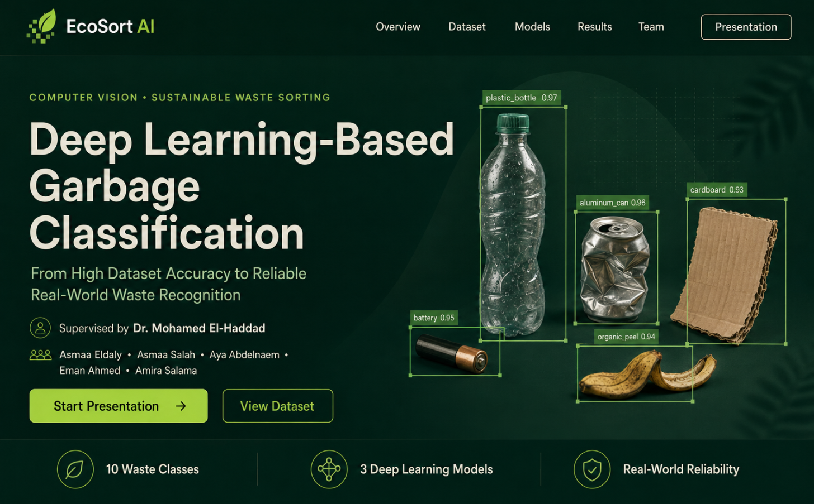
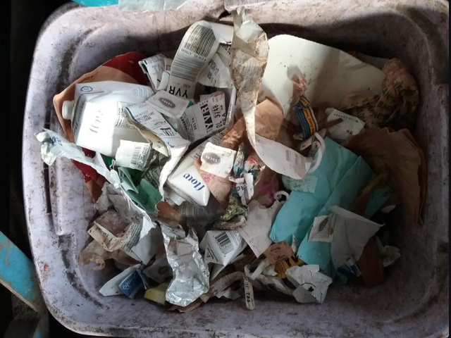
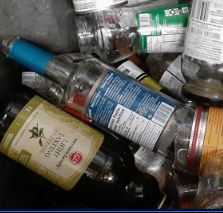
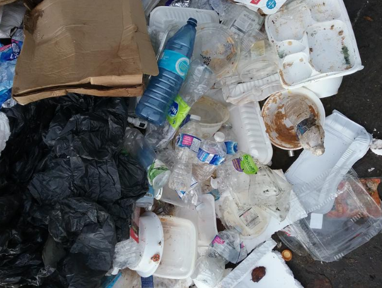

# EcoSort AI: Deep Learning-Based Garbage Classification

**EcoSort AI** is an end-to-end deep learning framework designed to enable reliable, real-world garbage classification. While standard waste datasets often achieve high accuracy under controlled conditions (clean objects, uniform backgrounds, single items), real-world waste recognition faces severe challenges such as occlusion, dirty or damaged materials, overlapping items, and complex backgrounds.
## Project Team & Supervision

- **Supervised by:** Professor Dr. Mohamed El-Haddad
- **Team Members:**
  - Eman Ahmed
  - Asmaa Salah
  - Aya Abdelnaem
  - Asmaa Eldaly
  - Amira Salama

This project establishes a strict, leak-free computer vision pipeline evaluating lightweight and modern convolutional architectures (ConvNeXt-Tiny, MobileNetV2, and EfficientNetV2-S) to bridge the gap between dataset accuracy and practical deployment.

### 📌 Project Features & Highlights

- **Data Integrity & Leak-Free Design:** Strict separation between training, validation, and held-out test splits with online data augmentation applied exclusively during training.
- **Robust Model Diversity:** Evaluates three primary models targeting distinct operational priorities: high feature accuracy (ConvNeXt-Tiny), balanced scaling (EfficientNetV2-S), and lightweight edge deployment (MobileNetV2).
- **High Resolution Processing:** Images processed at $384 \times 384$ resolution normalized with ImageNet statistics to capture granular texture details.
- **Cross-Validation Rigor:** 5-Fold Stratified Cross-Validation on the training/validation partitions before single-pass evaluation on the locked test set.

---

## 📊 Dataset & Visualizations

The project snapshot comprises **12,259** JPEG images categorized into **10** distinct classes:

| Class | Image Count | Class | Image Count |
| :--- | :--- | :--- | :--- |
| **Clothes** | 1,892 | **Cardboard** | 1,411 |
| **Glass** | 1,736 | **Paper** | 1,336 |
| **Plastic** | 1,597 | **Metal** | 930 |
| **Shoes** | 1,449 | **Battery** | 756 |
| **Biological** | 699 | **Trash** | 453 |

### Dataset Samples

Below are illustrative snapshots from actual collection bins used to gather data, highlighting material diversity and real-world challenges such as multiple items, unclassified waste, and contaminants:

The close-up view below illustrates the challenge of overlapping empty bottles (clear and green) with prominent labels, requiring precise feature discrimination from our models for accurate object recognition:

The final image reflects the diversity of paper and cardboard materials during the pre-sorting stage, including paper cups, fast-food boxes, and plain paper with varying colors and lighting conditions:

